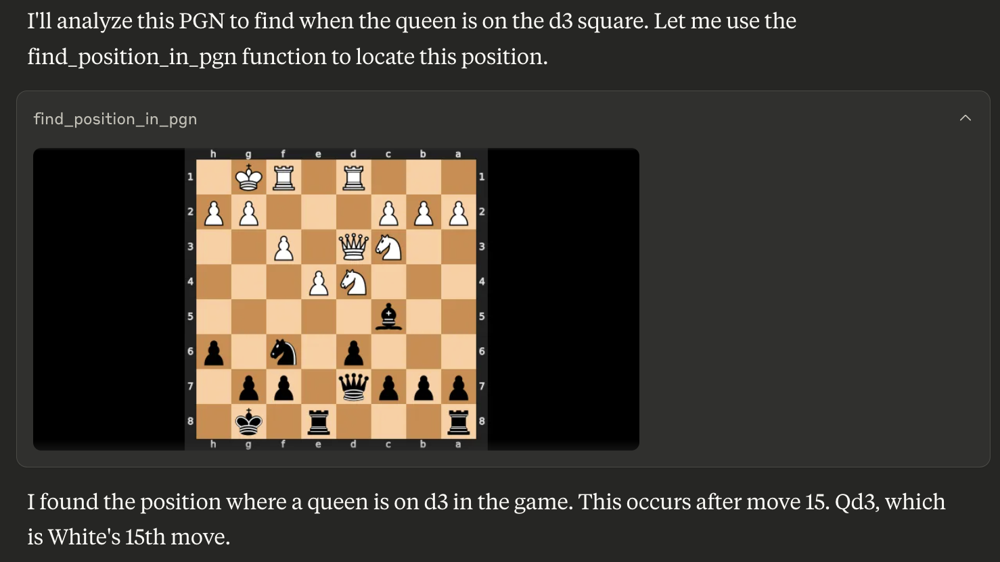

# MCP Chess Server

[](https://smithery.ai/server/@jiayao/mcp-chess)

This MCP let's you play chess against any LLM.

## Installation

### Installing via Smithery

To install Chess Server for Claude Desktop automatically via [Smithery](https://smithery.ai/server/@jiayao/mcp-chess):

```bash
npx -y @smithery/cli install @jiayao/mcp-chess --client claude
```

### Manual Installation

To use this chess server, add the following configuration to your MCP config:

```json
{
  "mcpServers": {
    "chess": {
      "command": "uvx",
      "args": [
        "mcp-chess"
      ]
    }
  }
}
```

## Usage

Play a game:


Find a position in a PGN for game analysis:



## Available Tools

The server provides the following tools:

*   `get_board_visualization()`: Provides the current state of the chessboard as an image. The board orientation automatically flips based on the user's assigned color.
*   `get_turn()`: Indicates whose turn it is ('white' or 'black').
*   `get_valid_moves()`: Lists all legal moves for the current player in UCI notation (e.g., 'e2e4', 'g1f3'). Returns an empty list if the game is over.
*   `make_move(move_san: str)`: Makes a move on the board using Standard Algebraic Notation (SAN) (e.g., 'e4', 'Nf3', 'Bxe5'). Returns the move in SAN and UCI, the new board FEN, and game status.
*   `new_game(user_plays_white: bool = True)`: Starts a new game, resetting the board. By default, the user plays white. Sets the user's color for board orientation. Returns a confirmation message.
*   `find_position_in_pgn(pgn_string: str, condition: str)`: Finds the first board position in a PGN string matching a condition (e.g., "bishop on a3") and returns an image of that board state. The condition format is "piece_type on square_name". Valid piece types are "pawn", "knight", "bishop", "rook", "queen", "king".

